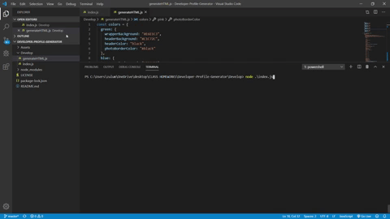

# Developer-Profile-Generator
Command-line application that dynamically generates a PDF profile from a GitHub username

#### User Story 

As a person who has a Github Profile

I want to dynamically generate a user profile page

With only being prompted to include my username

#### Installation/usage

Modules/tools
* Node.js
* puppeteer
* fs
* util
* axios

##### Credits

**ZVLU**

